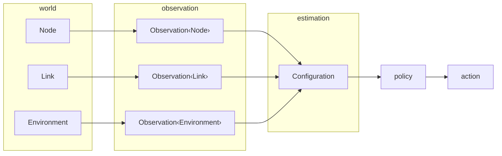

# Pipeline and World Observations

This page introduces Jacquard's shared routing pipeline and then covers the first two stages in detail. The world schema and the observation layer that wraps it both live in `jacquard-core`. They are family-neutral surfaces that every routing engine consumes.

## Pipeline

Jacquard's shared model is organized as a five-stage pipeline. `world` defines the abstract objects the router reasons about. `observation` wraps those objects with explicit provenance. `estimation` derives routing-relevant beliefs from the observation stream.

`policy` turns beliefs into the currently selected routing action. `action` records that selection as an `AdaptiveRoutingProfile`. The stages stay distinct even when one runtime computes several of them in a single component.



The rest of this page covers `world` and `observation`. See [Routing Decisions](105_routing_logic.md) for how `estimation`, `policy`, and `action` turn observations into realized routes.

## World Schema

The world has three shared scopes: local node, link, and environment. These types are routing-engine-neutral and live in `jacquard-core`. Routing engines consume them without forking the schema. An engine that wants richer structure derives it above this boundary as engine-private state.

### Node

`Node` is split into `NodeProfile` for stable limits and `NodeState` for current conditions. Both sub-objects live alongside a controller id that authenticates the node.

```rust
pub struct Node {
    pub controller_id: ControllerId,
    pub profile: NodeProfile,
    pub state: NodeState,
}

pub struct NodeProfile {
    pub services: Vec<ServiceDescriptor>,
    pub endpoints: Vec<LinkEndpoint>,
    pub connection_count_max: u32,
    pub neighbor_state_count_max: u32,
    pub simultaneous_transfer_count_max: u32,
    pub active_route_count_max: u32,
    pub relay_work_budget_max: u32,
    pub maintenance_work_budget_max: u32,
    pub hold_item_count_max: u32,
    pub hold_capacity_bytes_max: ByteCount,
}

pub struct NodeState {
    pub relay_budget: Belief<NodeRelayBudget>,
    pub available_connection_count: Belief<u32>,
    pub hold_capacity_available_bytes: Belief<ByteCount>,
    pub information_summary: Belief<InformationSetSummary>,
}

pub struct NodeRelayBudget {
    pub relay_work_budget: Belief<u32>,
    pub utilization_permille: RatioPermille,
    pub retention_horizon_ms: Belief<DurationMs>,
}
```

`NodeProfile` exposes device and policy constraints in a form the router can use without learning hardware details. `NodeState` says how much connection headroom, forwarding capacity, and retention space remain now. A node with spare capacity but a short `retention_horizon_ms` is a weak retention target because routing decisions depend on future forwarding value rather than current free space alone.

### Link

A connection is a `Link` with a stable `LinkEndpoint` and a changing `LinkState`.

```rust
pub struct Link {
    pub endpoint: LinkEndpoint,
    pub state: LinkState,
}

pub struct LinkState {
    pub state: LinkRuntimeState,
    pub median_rtt_ms: DurationMs,
    pub transfer_rate_bytes_per_sec: Belief<u32>,
    pub stability_horizon_ms: Belief<DurationMs>,
    pub loss_permille: RatioPermille,
    pub delivery_confidence_permille: Belief<RatioPermille>,
    pub symmetry_permille: Belief<RatioPermille>,
}
```

`transfer_rate_bytes_per_sec` answers whether a meaningful exchange fits inside the contact window. `stability_horizon_ms` answers how long the contact is likely to remain useful. `delivery_confidence_permille` and `symmetry_permille` answer whether the link supports exchange in the expected direction.

A routing engine that wants peer-relative novelty, reach, bridge value, or flow-gradient heuristics derives them above this shared boundary. Those estimates stay engine-owned rather than being promoted into the shared schema. See [Routing Decisions](105_routing_logic.md) for how engines consume the shared link signals.

### Environment

`Environment` carries routing-engine-neutral aggregate conditions.

```rust
pub struct Environment {
    pub reachable_neighbor_count: u32,
    pub churn_permille: RatioPermille,
    pub contention_permille: RatioPermille,
}
```

Density, churn, and contention matter most in sparse and disrupted networks. A contact that looks mediocre in isolation may still be valuable if the neighborhood is sparse or if the node bridges otherwise disjoint information sets.

Richer geometry, spatial embeddings, and transport-specific structure do not inflate the base environment type. GPS-derived regions, graph embeddings, provider clusters, bridge scores, and novelty rankings stay engine-private rather than becoming part of the base environment model.

### Configuration

`Configuration` wires the three world scopes into one routable view.

```rust
pub struct Configuration {
    pub epoch: RouteEpoch,
    pub nodes: BTreeMap<NodeId, Node>,
    pub links: BTreeMap<(NodeId, NodeId), Link>,
    pub environment: Environment,
}
```

One `Configuration` holds the current `epoch`, the node map, the link map keyed by ordered node-id pairs, and one `Environment`. A routing-engine planner receives this object wrapped as `Observation<Configuration>` and treats it as the authoritative view for that planning pass.

## Observation

The observation stage wraps each world object with provenance. `Observation<Node>`, `Observation<Link>`, and `Observation<Environment>` are the common scoped forms. `Observation<Configuration>` is the aggregated view a routing-engine planner consumes.

Jacquard uses an epistemic ladder so raw observation stays distinct from inferred belief and from established routing truth. `Observation<T>` is the base wrapper. `Estimate<T>` adds an explicit `confidence_permille`. `Fact<T>` marks values the control plane is willing to publish as routing truth.

`Belief<T>` wraps an optional estimate with an explicit `Absent` variant. Code can then tell "no estimate yet" from "estimated with low confidence" without unwrapping defaults. See [Core Types](102_core_types.md) for the full type definitions.

### Provenance Qualifiers

Observations carry four separate provenance qualifiers. Keeping them separate prevents one opaque enum from collapsing source, evidence, authentication, and identity-grounding into a single decision.

`FactSourceClass` says whether the observation is local or remote. `RoutingEvidenceClass` records what evidence backs the claim. `OriginAuthenticationClass` records how strongly the origin is authenticated. `IdentityAssuranceClass` on a node identity records how strongly that identity is grounded for committee or admission weight.

## The Observation Boundary

The routing core sees budget, retention horizon, link quality, and aggregate neighborhood conditions. It does not see device internals, radio chipset details, or raw signal traces. Keeping the boundary observational is what makes the model portable across devices and transports.

The boundary is observational only. It feeds planning, admission, and maintenance decisions. It does not publish canonical route truth on its own. Promotion from observation to established routing state belongs to the control plane through explicit route objects and lifecycle transitions.

Engine-specific peer or neighborhood heuristics live above this boundary. A mesh engine that wants novelty, reach, bridge, or flow-gradient estimates derives them from `Node`, `Link`, `Environment`, and world observations without promoting those derived estimates into the shared schema.

## Extending the World

World extensions are the entry path for observed nodes, links, environments, services, and transport activity. An extension emits `Observation<ObservedValue>` values that wrap objects conforming to the shared schema rather than defining a private alternative.

This boundary is where hardware-specific, runtime-specific, or transport-adjacent observation logic contributes to the world picture without taking ownership of routing semantics. See [Extensibility](106_extensibility.md) for the trait surface and an end-to-end BLE relay example.
