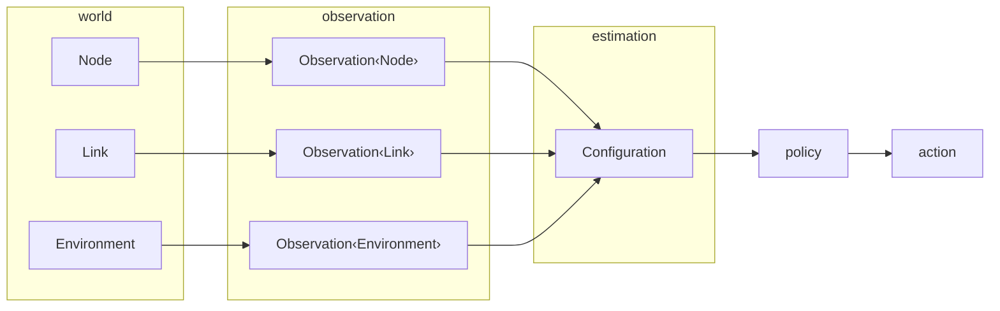

# Routing Observation Boundary

This page defines the abstraction boundary around the local node, peer connections, and local environment. The goal is to expose the information a routing algorithm needs without leaking raw device internals or physical-world details into the routing core.

## Purpose

The routing core sees budget, retention horizon, information summary, link quality, and aggregate neighborhood conditions. It does not see battery chemistry, radio chipset details, GPS coordinates, or raw signal traces. This keeps the model portable across devices and transports.

That boundary is also where Jacquard avoids becoming too opinionated. The shared layer exposes evidence that a routing engine may use for local coordination, but it does not tell every engine how to score peers, how to form committees, or whether any committee must have a leader.

Uncertain quantities are modeled as `Belief<T>`: either `Absent` or `Estimated(Estimate<T>)` with an explicit `confidence_permille`. Observations keep source and authentication separate. An `Observation<T>` may be local or remote, and its origin may be controlled, authenticated, or unauthenticated.

This boundary is observational only. It feeds planning, admission, and maintenance decisions, but it does not publish canonical route truth on its own. Promotion from observation to established routing state belongs to the control plane through explicit route objects and lifecycle transitions.

`IdentityAssuranceClass` complements those provenance fields. It lets policy and committee selection distinguish weakly observed identities from stronger controller-bound or externally attested ones without collapsing that decision into the routing objects themselves.

The model has three shared scopes: local node, link, and environment. `world` defines the abstract objects. `observation` wraps them with provenance. `estimation` stays family-neutral in `core`. Routing-engine-specific peer or neighborhood heuristics belong in the engine layer, not the shared world schema.



World extensions contribute through plain `Observation<ObservedValue>` values. That means the extension boundary stays about what was observed, not about how one host may later batch, diff, coalesce, or partially apply those observations.

## Local Node

`Node` is split into `NodeProfile` (stable limits) and `NodeState` (current conditions). `Observation<Node>` is one local or remote claim about that node.

```rust
pub struct Node {
    pub controller_id: ControllerId,
    pub profile: NodeProfile,
    pub state: NodeState,
}

pub struct NodeProfile {
    pub services: Vec<ServiceDescriptor>,
    pub endpoints: Vec<LinkEndpoint>,
    pub connection_count_max: u32,
    pub neighbor_state_count_max: u32,
    pub simultaneous_transfer_count_max: u32,
    pub active_route_count_max: u32,
    pub relay_work_budget_max: u32,
    pub maintenance_work_budget_max: u32,
    pub hold_item_count_max: u32,
    pub hold_capacity_bytes_max: ByteCount,
}

pub struct NodeState {
    pub relay_budget: Belief<NodeRelayBudget>,
    pub available_connection_count: Belief<u32>,
    pub hold_capacity_available_bytes: Belief<ByteCount>,
    pub information_summary: Belief<InformationSetSummary>,
}

pub struct NodeRelayBudget {
    pub relay_work_budget: Belief<u32>,
    pub utilization_permille: RatioPermille,
    pub retention_horizon_ms: Belief<DurationMs>,
}

pub struct Observation<T> {
    pub value: T,
    pub source_class: FactSourceClass,
    pub evidence_class: RoutingEvidenceClass,
    pub origin_authentication: OriginAuthenticationClass,
    pub observed_at_tick: Tick,
}
```

`NodeProfile` exposes device and local-policy constraints in a form the router can use without learning hardware details. `NodeState` says how much connection headroom, forwarding capacity, and retention space remain now. Routing decisions depend on future forwarding value, not only current free space. A node with spare capacity but a short `retention_horizon_ms` is a weak retention target.

## Link And Connection

A connection is a `Link` with a stable `LinkEndpoint` and a changing `LinkState`.

```rust
pub struct Link {
    pub endpoint: LinkEndpoint,
    pub state: LinkState,
}

pub struct LinkState {
    pub state: LinkRuntimeState,
    pub median_rtt_ms: DurationMs,
    pub transfer_rate_bytes_per_sec: Belief<u32>,
    pub stability_horizon_ms: Belief<DurationMs>,
    pub loss_permille: RatioPermille,
    pub delivery_confidence_permille: Belief<RatioPermille>,
    pub symmetry_permille: Belief<RatioPermille>,
}
```

`transfer_rate_bytes_per_sec` answers whether a meaningful exchange fits inside the contact window. `stability_horizon_ms` answers how long the contact is likely to remain useful. `delivery_confidence_permille` and `symmetry_permille` answer whether the link supports exchange in the expected direction.

If a mesh engine wants peer-relative novelty, reach, bridge value, or flow-gradient heuristics, it should derive them above this shared boundary from `Node`, `Link`, `Environment`, and world observations. Those estimates are mesh-owned interpretations, not shared world objects.

## Environment

`Environment` carries routing-engine-neutral aggregate conditions: density, churn, and contention.

```rust
pub struct Environment {
    pub reachable_neighbor_count: u32,
    pub churn_permille: RatioPermille,
    pub contention_permille: RatioPermille,
}
```

These signals matter most in sparse and disrupted networks. A contact that looks mediocre in isolation may still be valuable if the neighborhood is sparse, churn is high, or the node bridges otherwise disjoint information sets.

`Environment` should not include engine-specific concerns. Richer geometry, spatial embeddings, or transport-specific structure should extend `Configuration` in the engine layer rather than inflating the base environment type.

The same rule applies to coordination policy and derived heuristics. GPS-derived regions, graph embeddings, provider clusters, bridge scores, novelty rankings, or flow-direction estimates may exist above this boundary, but they should remain engine-private interpretations of shared observations rather than becoming part of the base environment model.

One naming distinction matters here. A routing neighborhood is a local topological or observational context. It is not the same thing as `ServiceScope::Discovery`, which uses `DiscoveryScopeId` only as a discovery-scope label for advertised services.
