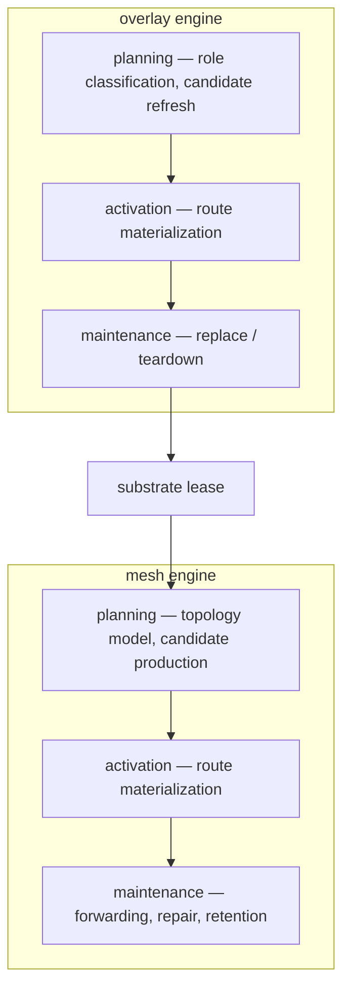

# Routing Logic

This page describes how routing decisions are structured. It covers the pipeline from world state through policy to canonical route realization, the control/data plane split, and the decision path.

## Pipeline

Jacquard's shared model is organized as a pipeline:

```text
world
  -> observation
  -> estimation
  -> policy
  -> action
```

`world` defines the abstract objects and configuration the router reasons about. `observation` wraps instantiated world objects with provenance. `estimation` derives routing-relevant beliefs from those observations. `policy` computes what should be done. `action` records the selected routing action, such as the current `AdaptiveRoutingProfile`.

## Planes

The control plane owns candidate gathering, admission, canonical identity allocation, materialized-route assembly, commitments, maintenance, and anti-entropy. The data plane forwards payloads over already admitted route state. Data-plane observations may report health or failures, but the control plane decides whether that changes the active materialized route.

If a routing engine needs local coordination, that also lives in the control plane. An engine may select a committee or witness set as part of planning, but those results are advisory inputs to canonical transitions. They are not canonical route truth by themselves.

The link layer is a frame carrier. It reports reachability, MTU, loss, and timing. It does not own canonical ordering or traffic control. If a routing engine needs sequencing or causal behavior, that appears as a routing-level message-flow assumption rather than a transport guarantee. Keeping the transport surface simple avoids head-of-line stalls on unstable links and prevents baking one delivery policy into every routing engine.

Layered composition follows the same rule. If one routing engine uses another as a limited substrate, the layering decision belongs above both engines in a host-owned policy engine. The lower layer exposes carrier capabilities and leases. The upper layer consumes those through a neutral contract. Neither engine needs direct awareness of the other's private scoring or maintenance logic.

## Decision Path

The routing decision path starts from `RoutingObjective` and `Observation<Configuration>`. A routing-engine planner turns those into `RouteCandidate` values. Each candidate carries an `Estimate<RouteEstimate>`, not a fact or published witness. The planner then checks one candidate and admits it under a stated profile. The router allocates canonical route identity, the routing engine realizes that admitted route under `RouteMaterializationInput`, and the control plane assembles the resulting `MaterializedRoute` from router-owned `MaterializedRouteIdentity` plus engine-owned `RouteRuntimeState`.

```rust
pub trait RoutingEnginePlanner {
    fn engine_id(&self) -> RoutingEngineId;
    fn capabilities(&self) -> RoutingEngineCapabilities;

    fn candidate_routes(
        &self,
        objective: &RoutingObjective,
        profile: &AdaptiveRoutingProfile,
        topology: &Observation<Configuration>,
    ) -> Vec<RouteCandidate>;

    fn check_candidate(
        &self,
        objective: &RoutingObjective,
        profile: &AdaptiveRoutingProfile,
        candidate: &RouteCandidate,
        topology: &Observation<Configuration>,
    ) -> Result<RouteAdmissionCheck, RouteError>;

    fn admit_route(
        &self,
        objective: &RoutingObjective,
        profile: &AdaptiveRoutingProfile,
        candidate: RouteCandidate,
        topology: &Observation<Configuration>,
    ) -> Result<RouteAdmission, RouteError>;
}

pub trait RoutingEngine: RoutingEnginePlanner {
    fn materialize_route(
        &mut self,
        input: RouteMaterializationInput,
    ) -> Result<RouteInstallation, RouteError>;

    fn route_commitments(&self, route: &MaterializedRoute) -> Vec<RouteCommitment>;

    fn engine_tick(
        &mut self,
        topology: &Observation<Configuration>,
    ) -> Result<(), RouteError> { Ok(()) }

    fn maintain_route(
        &mut self,
        identity: &MaterializedRouteIdentity,
        runtime: &mut RouteRuntimeState,
        trigger: RouteMaintenanceTrigger,
    ) -> Result<RouteMaintenanceResult, RouteError>;

    fn teardown(&mut self, route_id: &RouteId);
}
```

Route construction starts from shared observations, becomes inferential during candidate production, becomes proof-bearing at admission, and becomes canonical only when the router allocates route identity and the engine realizes the admitted route. The planning side is deterministic and read-only. Runtime mutation starts at `materialize_route`, but canonical route ownership stays above the engine boundary. The control plane must enforce the objective protection floor and treat expired leases as a typed failure.

`engine_tick` is the optional engine-wide convergence hook for refreshing local regime estimates, decaying stale state, or updating coordination posture before any specific route is active.

Committee selection, substrate planning, and layered routing follow the same pure/effectful split. See [Extensibility](107_extensibility.md) for the full trait signatures.

### Overlay Example

Layering lets an overlay engine use mesh as a carrier without awareness of mesh-private topology. Mesh provides substrate reachability inside one cluster. The overlay engine consumes those paths as leased substrates for inter-cluster carriage or egress.



The overlay engine's `engine_tick` drives the middleware stages shown above: classify the local node as member, bridge, or gateway, update overlay posture, then refresh candidates before any specific route is activated. Route activation, maintenance, and teardown still use the shared `RoutingEngine` traits.
