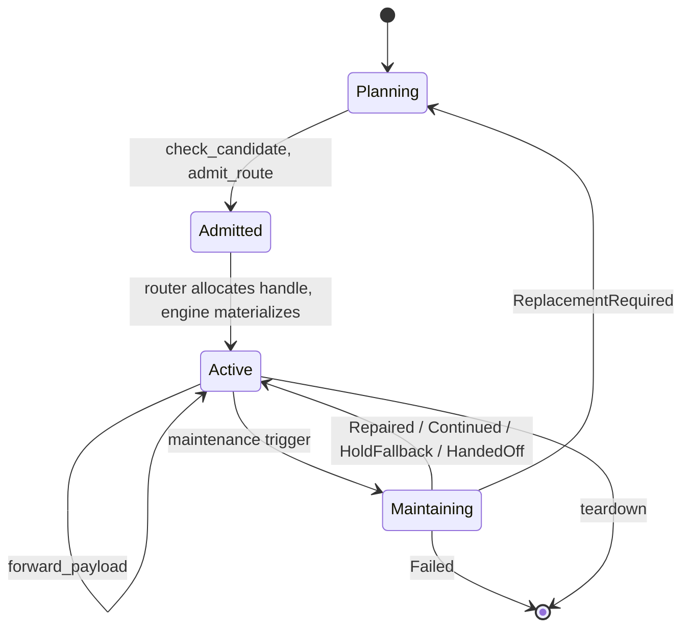
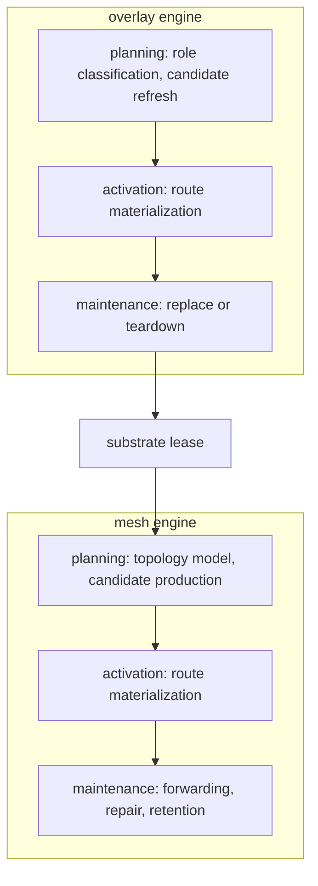

# Route Lifecycle

This page describes how a route moves from a routing objective through candidate production, admission, materialization, active forwarding, maintenance, and teardown. See [Pipeline and World Observations](203_pipeline_observations.md) for the world and observation stages that feed into the lifecycle, and [Routing Engines](303_routing_engines.md) for the trait surface engines implement to participate in it.

## Lifecycle Overview

A route starts as a `RoutingObjective` paired with an `Observation<Configuration>`. The planner produces candidates, the engine admits one against the current observed topology, the router allocates canonical identity, and the engine realizes the admitted route as a `MaterializedRoute`.

Forwarding then happens through the data plane against that materialized route. Maintenance triggers can repair, hand off, drop into hold-fallback, or escalate to replacement. Replacement loops back to the planning step under the same objective. Teardown closes the lifecycle from any active state.

## Planes

The control plane owns candidate gathering, admission, canonical identity allocation, materialized-route assembly, commitments, maintenance, and anti-entropy. The data plane forwards payloads over already admitted route state. Data-plane observations may report health or failures. The control plane decides whether any of that changes the active materialized route.

Local coordination also belongs to the control plane. A routing engine may select a committee or witness set as part of planning. Those results are advisory inputs to canonical transitions rather than canonical route truth.

The link layer is a frame carrier. It reports reachability, MTU, loss, and timing. It does not own canonical ordering or traffic control. A routing engine that needs sequencing or causal behavior expresses it as a routing-level message-flow assumption rather than a transport guarantee.

### Layered Composition

Layered composition follows the same rule as plane separation. If one routing engine uses another as a limited substrate, the layering decision belongs above both engines in a host-owned policy engine.

The lower engine exposes carrier capabilities and leases. The upper engine consumes those through a neutral contract. Neither engine needs direct awareness of the other's private scoring or maintenance logic.

## Decision Path

The routing decision path starts from a `RoutingObjective` and a current `Observation<Configuration>`. A routing-engine planner turns those into `RouteCandidate` values. Each candidate carries an `Estimate<RouteEstimate>` rather than a fact or published witness.

The planner checks a candidate and admits it under a stated profile. The router then allocates canonical route identity. The routing engine realizes that admitted route under `RouteMaterializationInput`. The control plane assembles the final `MaterializedRoute` from router-owned `PublishedRouteRecord` plus engine-owned `RouteRuntimeState`.

`RoutingEnginePlanner` is the pure planning surface. Runtime mutation is confined to `RoutingEngine::materialize_route`, `maintain_route`, and `teardown`. The control plane enforces the objective protection floor at materialization. Expired leases surface as a typed failure rather than silently continuing.

### Contract Rules

Two implementation rules keep the planning surface honest. First, any planning or admission judgment that depends on observed world state must receive `&Observation<Configuration>` explicitly rather than reading an ambient topology snapshot. Second, planner caches are optimization only.

Cache misses must still lead to the same planning or admission result for the same topology. Admitted routes must carry enough opaque engine-private plan state forward that materialization can proceed without a planner-cache lookup. Materialization must fail closed when required observed topology is missing. Successful lifecycle transitions must remain replay-visible before public or durable state is committed, so engines should stage the next runtime state off to the side until checkpointing and route-event logging succeed.

`engine_tick` is the optional engine-wide convergence hook for refreshing local regime estimates, decaying stale state, retaining bounded observational summaries, or updating coordination posture before any specific route is active. In richer engines that can include maintaining bounded repair pressure, anti-entropy pressure, or transport-derived health posture. See [Routing Engines](303_routing_engines.md) for the full trait signatures.

First-party mesh now routes protocol-side runtime work through a private choreography guest runtime before it touches transport, retention, route-event logging, or protocol checkpoint storage. That keeps the public lifecycle contract unchanged while making forwarding, repair, handoff, hold/replay, and tick-ingress sequencing explicit and replay-friendly inside the owning engine crate.

## Active Route

A `MaterializedRoute` is split into router-owned `PublishedRouteRecord` and engine-owned `RouteRuntimeState`. The data plane forwards payloads through `RoutingDataPlane::forward_payload` against the materialized route. The control plane consumes data-plane health signals as observational input but does not promote them into canonical state without an explicit lifecycle event.

Route health stays route-scoped rather than engine-global. When an engine can validate the active route's remaining suffix against current observations, it should publish route-local reachability and stability. When it cannot, it should use an explicit unknown reachability state rather than silently treating the route as healthy or dead from unrelated engine-level signals.

## Maintenance

Maintenance is expressed through `RoutingEngine::maintain_route`, which receives a `RouteMaintenanceTrigger` and returns a typed `RouteMaintenanceResult`. The trigger names what happened: `LinkDegraded`, `EpochAdvanced`, `CapacityExceeded`, `PartitionDetected`, `PolicyShift`, `AntiEntropyRequired`, `LeaseExpiring`, or `RouteExpired`. The result wraps an outcome variant: `Continued`, `Repaired`, `HoldFallback`, `HandedOff`, `ReplacementRequired`, or `Failed`.

`ReplacementRequired` returns the route to the planning stage with the same objective. The control plane treats it as the explicit replace path, not an in-place engine mutation. The engine never publishes canonical changes by side channel.

`RoutingEngine::teardown` is the explicit lifecycle terminator and may be called from any active state. Lease expiry is the second terminal path. When the router-owned lease window passes, maintenance returns `Failed` with a lease-expired reason regardless of which trigger arrived.

## Overlay Example

Layering lets an overlay engine use mesh as a carrier without awareness of pathway-private topology. Mesh provides substrate reachability inside one cluster. The overlay engine consumes those paths as leased substrates for inter-cluster carriage or egress.

The overlay engine's `engine_tick` drives the middleware stages shown above. It classifies the local node as member, bridge, or gateway. It then refreshes overlay posture and candidate state before any specific route is activated. Route activation, maintenance, and teardown still use the shared `RoutingEngine` traits.
