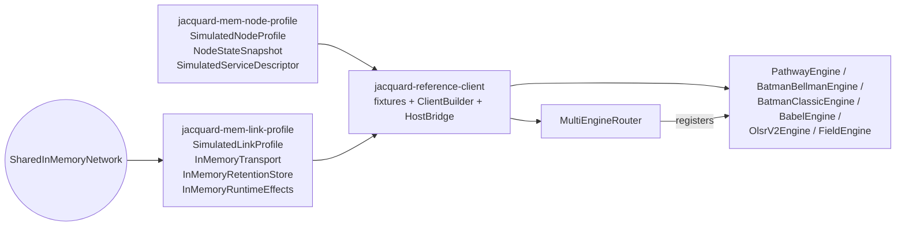

# Profile Implementations

`jacquard-mem-node-profile`, `jacquard-mem-link-profile`, and `jacquard-reference-client` are Jacquard's in-tree profile and composition crates. The two `mem-*` crates model node and link inputs without importing routing logic. `jacquard-adapter` sits beside them as the reusable support crate for transport/profile implementers. The reference client composes those profile implementations with `jacquard-router` and the in-tree routing engines to exercise the full shared routing path in tests.

## Ownership Boundary

Profile crates are `Observed`. They model capability advertisement, transport carriage, and link-level state. They do not plan routes, issue canonical handles, publish route truth, or interpret routing policy.

Canonical route ownership remains on the router, and engine-private runtime state remains inside the routing engine. This keeps profile code reusable across routing engines and prevents observational fixtures from drifting into shadow control planes.

`jacquard-core` types flow through these crates unchanged. `Node`, `NodeProfile`, `NodeState`, `Link`, `LinkEndpoint`, `LinkState`, and `ServiceDescriptor` keep their shared-model shape end to end. The `mem-*` crates wrap builders around those shared objects instead of replacing or reshaping them, and the reference client hands the constructed world picture to the router as a plain `Observation<Configuration>`.

## Crate Responsibilities

| Crate | Provides | Shared boundary it implements |
| --- | --- | --- |
| `jacquard-adapter` | `TransportIngressSender`, `TransportIngressReceiver`, `TransportIngressNotifier`, `TransportIngressDrain`, `PeerDirectory`, `PendingClaims`, `ClaimGuard` | none. It provides transport-neutral adapter support primitives over `jacquard-core` vocabulary |
| `jacquard-mem-node-profile` | `SimulatedNodeProfile`, `NodeStateSnapshot`, `SimulatedServiceDescriptor` builders | none. It only emits `jacquard-core` model values |
| `jacquard-mem-link-profile` | `SimulatedLinkProfile`, `SharedInMemoryNetwork`, `InMemoryTransport`, `InMemoryRetentionStore`, `InMemoryRuntimeEffects`, transport-neutral reference defaults | `TransportSenderEffects`, `TransportDriver`, `RetentionStore`, `TimeEffects`, `OrderEffects`, `StorageEffects`, `RouteEventLogEffects` |
| `jacquard-reference-client` | `ClientBuilder`, `HostBridge`, `ReferenceRouter`/`ReferenceClient` aliases, plus `NodePreset`, `NodePresetOptions`, `NodeIdentity`, `LinkPreset`, and `LinkPresetOptions` re-exported from the mem profile crates | none. It is pure composition over the crates above |

The `mem-*` crates stay routing-engine-neutral and transport-neutral. They carry frames, emit observations, and build shared model values. They do not mint route truth, interpret routing policy, or own BLE or IP-specific authoring helpers.

`jacquard-adapter` likewise stays transport-neutral. It owns generic ownership scaffolding only, not endpoint constructors, protocol state, or driver traits.

Reference-client fixtures are the single place where a service descriptor picks up engine-specific routing-engine tags such as `PATHWAY_ENGINE_ID`, `BATMAN_BELLMAN_ENGINE_ID`, or `BABEL_ENGINE_ID`. That decision is composition, not profile. The reference-client bridge is also the only sanctioned place where transport ingress is drained and stamped before delivery to the router.

## Composition

`ClientBuilder` is the wiring entry point. It attaches one bridge-owned `InMemoryTransport` driver to a `SharedInMemoryNetwork`, constructs queue-backed sender capabilities for each enabled engine, registers the engine set on a fresh `MultiEngineRouter`, and returns a `ReferenceClient` host bridge. The builder supports any combination of `pathway`, `batman-bellman`, `batman-classic`, `babel`, `olsrv2`, `field`, and `scatter` engines. Multiple clients built against the same network share one deterministic carrier while still advancing routing state through explicit bridge rounds.

The reference end-to-end examples are the split `reference-client` tests in [`crates/reference-client/tests/client_builder.rs`](../crates/reference-client/tests/client_builder.rs), [`crates/reference-client/tests/e2e_pathway_shared_network.rs`](../crates/reference-client/tests/e2e_pathway_shared_network.rs), [`crates/reference-client/tests/e2e_batman_pathway_handoff.rs`](../crates/reference-client/tests/e2e_batman_pathway_handoff.rs), [`crates/reference-client/tests/e2e_olsrv2_shared_network.rs`](../crates/reference-client/tests/e2e_olsrv2_shared_network.rs), and [`crates/reference-client/tests/e2e_olsrv2_pathway_handoff.rs`](../crates/reference-client/tests/e2e_olsrv2_pathway_handoff.rs), plus the shared scenarios in [`crates/testkit/src/reference_client_scenarios.rs`](../crates/testkit/src/reference_client_scenarios.rs). They show how to add a new client runtime to the same in-memory network without bypassing the bridge-owned ingress path or the router-owned canonical path.

For custom link or node profile work, start from the in-tree builders in `jacquard-mem-link-profile` and `jacquard-mem-node-profile`, then validate the ownership boundaries against [Crate Architecture](999_crate_architecture.md).
