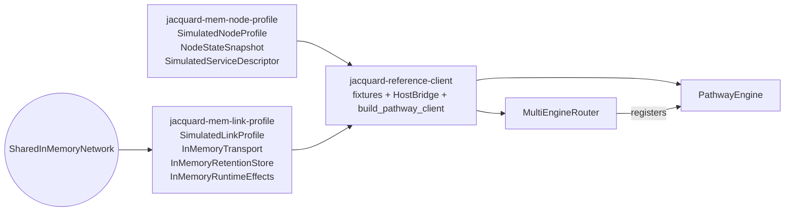

# Profile Implementations

`jacquard-mem-node-profile`, `jacquard-mem-link-profile`, and `jacquard-reference-client` are Jacquard's in-tree profile and composition crates. The two `mem-*` crates model node and link inputs without importing routing logic. The reference client composes those profile implementations with `jacquard-router` and `jacquard-pathway` to exercise the full shared routing path in tests.

## Ownership Boundary

Profile crates are `Observed`. They model capability advertisement, transport carriage, and link-level state. They do not plan routes, issue canonical handles, publish route truth, or interpret routing policy. Canonical route ownership remains on the router, and engine-private runtime state remains inside the routing engine. This keeps profile code reusable across routing engines and prevents observational fixtures from drifting into shadow control planes.

`jacquard-core` types flow through these crates unchanged. `Node`, `NodeProfile`, `NodeState`, `Link`, `LinkEndpoint`, `LinkState`, and `ServiceDescriptor` keep their shared-model shape end to end. The `mem-*` crates wrap builders around those shared objects instead of replacing or reshaping them, and the reference client hands the constructed world picture to the router as a plain `Observation<Configuration>`.

## Crate Responsibilities

| Crate | Provides | Shared boundary it implements |
| --- | --- | --- |
| `jacquard-mem-node-profile` | `SimulatedNodeProfile`, `NodeStateSnapshot`, `SimulatedServiceDescriptor` builders | none — it only emits `jacquard-core` model values |
| `jacquard-mem-link-profile` | `SimulatedLinkProfile`, `SharedInMemoryNetwork`, `InMemoryTransport`, `InMemoryRetentionStore`, `InMemoryRuntimeEffects`, transport-neutral reference defaults | `TransportSenderEffects`, `TransportDriver`, `RetentionStore`, `TimeEffects`, `OrderEffects`, `StorageEffects`, `RouteEventLogEffects` |
| `jacquard-reference-client` | `topology::{route_capable_node, active_link}`, `HostBridge`, `PathwayRouter`/`PathwayClient` aliases, `build_pathway_client` | none — it is pure composition over the crates above |

The `mem-*` crates stay routing-engine-neutral and transport-neutral: they carry frames, emit observations, and build shared model values, but they do not mint route truth, interpret routing policy, or own BLE/IP-specific authoring helpers. Reference-client fixtures are the single place where a service descriptor picks up the `PATHWAY_ENGINE_ID` routing-engine tag, because that decision is composition, not profile. The reference-client bridge is also the only sanctioned place where transport ingress is drained and stamped before delivery to the router.

## Composition

`build_pathway_client` and `build_pathway_client_with_profile` are the wiring entry points. They attach one bridge-owned `InMemoryTransport` driver to a `SharedInMemoryNetwork`, construct queue-backed sender capabilities for pathway (and optionally batman), plug those into a `PathwayEngine` over a `DeterministicPathwayTopologyModel`, register the engine set on a fresh `MultiEngineRouter`, and return a `PathwayClient` host bridge. Multiple clients built against the same network share one deterministic carrier while still advancing routing state through explicit bridge rounds.

The reference end-to-end example is [`e2e_multi_layer_routing.rs`](../crates/reference-client/tests/e2e_multi_layer_routing.rs). It shows how to add a new client runtime to the same in-memory network without bypassing the bridge-owned ingress path or the router-owned canonical path.

## Extension Guidance

Mirror the existing layering when adding a new device or transport profile. Build node-side world inputs as builders over the shared `NodeProfile`, `NodeState`, and `ServiceDescriptor` types. Build link-side and transport behavior as adapters that implement the shared effect boundaries listed above. Compose the new profile with the router and a routing engine through a host harness that looks like `jacquard-reference-client`. Do not introduce a parallel node schema, a pathway-specific transport trait, or transport-specific endpoint constructors inside the mem/reference profile crates.

Keep the ownership boundary strict. Profile crates stay `Observed`. Routers stay the canonical `ActorOwned` route publisher. Routing engines own only route-private runtime state and typed evidence. The [Crate Architecture](999_crate_architecture.md) document has the full dependency graph and ownership rules these crates fit into.
